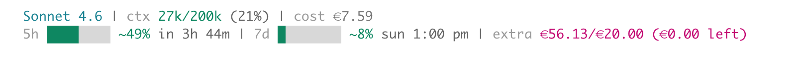

# inline-claude-usage

Real-time Claude usage in your Claude Code terminal status line.

```
Claude Sonnet 4.6 | ctx 18k/200k (9%) | cost €0.09
5h ██░░░░░░ ~17% in 4h 18m | 7d ███░░░░░ ~31% sun 1:00pm | spent €17.43 this month
```



Two lines, always visible — even on narrow terminals. Colors shift green → yellow → red as you approach your limits.

---

## What it shows

| Field | Description |
|---|---|
| Model | Which Claude model is active |
| ctx | Context window tokens used, total, and % |
| cost | Cost of the current session |
| 5h | Your 5-hour session usage % and time until it resets |
| 7d | Your weekly usage % and when the weekly reset is |
| spent / extra | Monthly spend — with or without a cap |
| ⚠ drift warning | Appears when estimated usage diverges by ≥15% from calibration — prompts you to reconfigure |

All data is read locally from `~/.claude/` — no extra API calls, no telemetry.

---

## Requirements

- [Claude Code](https://claude.ai/code) installed and configured
- [Node.js](https://nodejs.org) v16 or higher

---

## Install

Paste this into your terminal (or directly into Claude Code's terminal):

```bash
git clone https://github.com/Code-Hugo/inline-claude-usage.git ~/inline-claude-usage && ~/inline-claude-usage/install.sh
```

That's it — the setup wizard launches immediately after cloning. Follow the prompts and you'll be done in under two minutes.

> Want to install somewhere other than `~/inline-claude-usage`? Clone to any folder you like and run `./install.sh` from inside it.

---

## Setup wizard

The wizard runs automatically on first install. It walks you through five steps.

### Step 1 — Plan

Choose your Claude plan:

```
  ○ 1. Claude Pro
  ○ 2. Claude Max ($100/mo)
  ○ 3. Claude Max ($200/mo)
  ● 4. Claude Team
  ○ 5. Claude API (pay-as-you-go)
```

- **Pro / Max** — sensible token limit defaults are pre-filled. You can accept them or calibrate from live usage.
- **Team** — limits vary by contract, so you'll calibrate from your current usage in Claude's settings (takes ~30 seconds).
- **API** — no session/weekly limits; only monthly spend is tracked.

**Example input:** `4` *(for Team)*

---

### Step 2 — Currency

```
? Currency symbol  [€]:
? USD → € rate     [0.92]:
```

Enter your currency symbol and the USD conversion rate. The wizard fetches a live rate from [frankfurter.app](https://www.frankfurter.app) and pre-fills it — just press Enter to accept it, or type your own.

**Example inputs:**
- Symbol: `€` *(or `$`, `£`, `¥`, etc. — press Enter to keep the default)*
- Rate: `0.92` *(press Enter to accept the live rate, or override with your own)*

If you use USD, enter `$` and `1`.

---

### Step 3 — Monthly spend cap

```
? Monthly cap in €  [skip]:
```

This sets an optional budget. If you hit it, the spend line turns red.

**On Team plan:** billing goes to your organisation, so you may not have a personal cap — just type `skip` (or press Enter) and the tool will show your monthly spend without a limit.

**Example inputs:**
- `skip` — just track spend with no limit
- `20` — set a €20/month cap
- `100` — set a €100/month cap

---

### Step 4 — Usage limits (calibration)

This is what makes the 5h and 7d percentages accurate. You'll need Claude's settings page open.

**Open:** `claude.ai → Settings → Usage`

You'll see something like:

```
Usage limits
5-hour session      Resets in 4 hr 18 min     32%  ████░░░
This week           Resets Sun 1:00 PM          5%  █░░░░░░
```

The wizard asks you four things from that screen:

```
? Session resets in / at  (e.g. 4h 18m  or  6:03 PM):
→ Type: 4h 18m

? Usage % shown  (e.g. 17, or 0 if none yet):
→ Type: 32

? Usage % shown  (e.g. 3, or 0 if none yet):
→ Type: 5

? Weekly resets on  (e.g. Sun 1:00 PM  or  45m):
→ Type: Sun 1:00 PM
```

The tool back-calculates your token limits from what you enter here, so the percentages stay accurate going forward.

> **If you have 0% usage or just started a new session:** Type `0` at any percentage prompt. For Team plan this drops into manual token entry (your team admin may know the contract limits). For Pro/Max it confirms the preset.

> **Weekly reset is imminent?** If the reset is just minutes away, type `45m` (or however many minutes remain) instead of a day name. The wizard will calculate the exact time and confirm "resets later today at …".

**For Pro / Max users:** preset defaults are shown and calibration is optional:

```
  Preset defaults for Claude Pro:
    5h session : 88,000 tokens
    7d weekly  : 440,000 tokens

? Calibrate from live usage? [y/N]:
```

Press Enter to accept the defaults, or `y` to calibrate from Claude's settings.

---

### Step 5 — Display

```
? Disable status line? [n]:
```

Press Enter to keep the status line active. Type `y` to hide it without removing it from Claude Code's settings — useful if you want to pause it temporarily.

---

## Updating

If you already have the tool installed, just pull the latest changes from inside the cloned folder:

```bash
cd ~/inline-claude-usage   # or wherever you cloned it
git pull
```

That's it. Claude Code runs `index.js` directly from that folder each time the status bar refreshes, so the new version is picked up immediately — no re-install or restart needed.

---

## Reconfiguring

Run setup again at any time — for example after switching plans, or if the percentages feel off:

```bash
claude usage --reconfigure
```

Your existing values are shown as defaults so you only need to change what's different.

To re-enable the status line in Claude Code without re-running the full wizard (e.g. after manually editing `~/.claude/settings.json`):

```bash
claude usage --start
```

This just writes the `statusLine` entry into your settings and prints a confirmation. Open (or restart) Claude Code and the bar appears immediately.

> The installer adds a `claude usage` shell function to your `~/.zshrc`. If you're on bash, it's added to `~/.bashrc`. If the command isn't found after install, run `source ~/.zshrc` (or open a new terminal).

---

## How it works

When Claude Code refreshes its status bar, it runs `index.js` and displays the output.

- **Model, context window, session cost** — received directly from Claude Code via stdin (accurate and always current)
- **5h / 7d usage** — calculated from `~/.claude/projects/**/*.jsonl`, the local conversation logs Claude Code writes automatically
- **Monthly spend** — aggregated from the same JSONL files using published Anthropic pricing
- **Config** — stored at `~/.claude/inline-claude-usage.json`

### How the 5h and 7d percentages are estimated

The tool counts tokens from your local JSONL history and divides by the limit you calibrated during setup. The token limit is back-calculated from the percentage you read off Claude's settings page — so if you told the wizard "I'm at 32% with a session reset in 4h 18m", it works backwards to derive your limit.

**Important: the tool only sees Claude Code activity.** It reads local files that Claude Code writes — it has no visibility into sessions from claude.ai in your browser, the API, or other clients. If you use Claude outside of the CLI, your true usage will be higher than what this tool shows.

For that reason, **we recommend running `--reconfigure` every few days**, or any time the displayed % looks noticeably lower than what Claude's settings page shows:

```bash
claude usage --reconfigure
```

This re-anchors the estimate to your current live usage and keeps the percentages accurate.

### Drift notifications

When the tool detects that your estimated usage has crossed a new 15% milestone (e.g. 30%, 45%, 60%…), it shows a warning in the status line:

```
⚠ ~45% — run: claude usage
```

Running `claude usage` opens a short prompt with three options:

- **y** — launch the reconfigure wizard immediately to re-anchor your estimate
- **n** — dismiss the warning for this milestone (it will reappear at the next 15% step)
- *(press Enter)* — snooze for 30 minutes

This helps catch drift before it becomes significant.

### Compact display

When your context window reaches 80%, Claude Code inserts a "% until auto-compact" notice that reduces the available width. The tool automatically switches to a compact layout — shorter bars, abbreviated time format, monthly spend hidden — so both lines stay fully visible.

### Session reset accuracy

Right after you run `--reconfigure`, the session countdown is anchored to the exact time you entered, so it matches Claude's UI perfectly. Once your session resets naturally, the tool smoothly switches to estimating the next reset from your JSONL history. It stays accurate without needing another reconfigure.

### First run

If no config file is found, the status line shows a setup prompt:

```
⚙ inline-claude-usage not configured — run: node /path/to/setup.js
```

Run the command shown, complete the wizard, then restart Claude Code.

---

## Disabling / removing

To **pause** the status line without uninstalling: re-run setup and answer `y` at Step 5, or set `"disabled": true` in `~/.claude/inline-claude-usage.json`.

To **remove it entirely**: delete the `statusLine` entry from `~/.claude/settings.json`.

---

## Troubleshooting

**The 5h or 7d % shows 100% or looks wrong**

Your token limits are probably off. Re-run setup and calibrate from your current % in Claude's settings:

```bash
node /path/to/inline-claude-usage/setup.js --reconfigure
```

**The session countdown doesn't match Claude's UI**

Re-run `--reconfigure` while Claude's settings page is open, and enter the values shown there (Step 4). The countdown will sync immediately.

**I'm on Team plan and have no recent usage to calibrate from**

Use Claude for a few minutes first, then re-run setup. Alternatively, type `0` at the % prompts to enter token limits manually — your team admin may know the contract limits.

**The cost shown doesn't match Claude's billing exactly**

Cost is estimated from local token counts using published Anthropic pricing. Minor differences are normal. For exact billing, check `claude.ai → Settings → Billing`. On Team plan, billing goes to your organisation.

**Nothing appears in the status line**

Make sure Claude Code's settings have the `statusLine` entry. The installer adds it automatically, but you can check `~/.claude/settings.json`:

```json
{
  "statusLine": {
    "type": "command",
    "command": "node /path/to/inline-claude-usage/index.js"
  }
}
```

---

## Config file reference

Located at `~/.claude/inline-claude-usage.json` after setup.

| Key | Type | Description |
|---|---|---|
| `plan` | string | Your plan: `pro`, `max100`, `max200`, `team`, `api` |
| `currencySymbol` | string | Symbol shown in output, e.g. `€` |
| `usdToLocalRate` | number | USD to local currency conversion rate |
| `monthlyCapUSD` | number | Monthly spend cap in USD (0 = no cap, show spend only) |
| `sessionLimitTokens` | number | Token limit for the 5h window |
| `weeklyLimitTokens` | number | Token limit for the 7d window |
| `sessionWindowHours` | number | Session window size in hours (default: 5) |
| `weeklyResetDay` | number | Day of week for weekly reset (0 = Sunday) |
| `weeklyResetHour` | number | Hour of weekly reset in local time |
| `weeklyResetMinute` | number | Minute of weekly reset |
| `disabled` | boolean | Set `true` to hide the status line |
| `pricing` | object | Per-model pricing in USD per million tokens |
| `lastCalibratedAt` | string | ISO timestamp of last successful calibration |
| `driftLevel` | number | Highest 15%-milestone reached since last calibration |
| `driftDismissed` | number | Highest milestone the user has dismissed |
| `driftSnoozedUntil` | string | ISO timestamp until drift warning is snoozed |

---

## License

MIT
